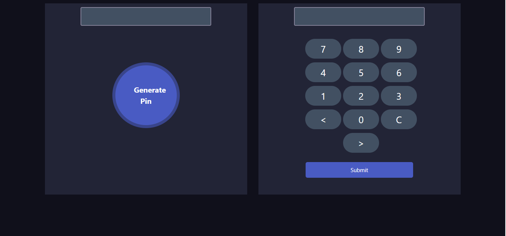

# Project: Pin Matcher
<h2>project features</h2>

In this project, users generate a random pin number. If they enter the pin accurately then they see the success message. They get three chances to enter the pin number
accurately. If they failed to submit the accurate pin within three times then the submit button disable automatically.

<h2>Project screenshot</h2>

#<h1><a href="https://jahidulbinrafiq.github.io/pin-matcher/">Live</a></h2>

 
